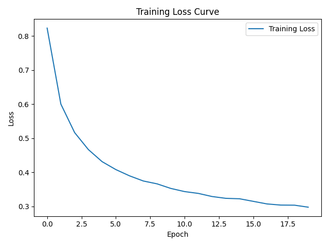

# Network Anomaly Detection with Autoencoder

## Project Overview

This project implements an anomaly detection system for network traffic using an autoencoder trained exclusively on normal data. The model learns to reconstruct typical network behavior, and anomalies are identified based on reconstruction error.

A validation-based threshold selection strategy is used to optimize anomaly detection performance, ensuring a balanced trade-off between precision and recall. The project is structured as a reproducible end-to-end ML pipeline, covering data preprocessing, model training, threshold tuning, evaluation, and artifact generation.

## Key Features

- End-to-end ML pipeline (data loading → preprocessing → training → evaluation → artifact saving)
- Unsupervised anomaly detection using autoencoder trained on normal traffic only
- Threshold optimization on validation set using F1-score
- Proper train / validation / test split to avoid data leakage
- Consistent feature engineering across datasets (aligned one-hot encoding)
- Reproducible experiments via configuration file
- Saved artifacts: trained model, scaler, threshold, evaluation metrics, training loss plot

## Tech Stack

- **Python**
- **PyTorch** - modeling and training
- **pandas, NumPy** - data processing
- **scikit-learn** - preprocessing, metrics
- **PyYAML** - configuration management
- **matplotlib** - visualization
- **pytest** - unit testing

## Dataset

The project uses the KDD Cup 1999 dataset for network intrusion detection, which contains simulated network traffic labeled as either normal or belonging to a specific type of attack.

- Number of samples: ~494,000
- Number of features: 41
- Target column: `outcome`

Each record represents a network connection described by a mix of numerical and categorical features (e.g., protocol type, service, traffic statistics).

For the purpose of anomaly detection:
- `normal` connections are treated as inliers,
- all other classes are treated as anomalies.

The dataset is included in the repository for reproducibility.

A small sample file (`data/sample.csv`) is included for quick inference testing.

> Data source: UCI Machine Learning Repository / KDD Cup 1999

## Problem Formulation

The task is framed as an anomaly detection problem rather than a standard supervised classification task.

The model is trained exclusively on normal network traffic, learning the typical patterns of legitimate connections. During inference, samples that deviate significantly from this learned distribution are flagged as anomalies.

Key assumptions:
- Normal traffic is well represented in the training data
- Anomalies differ sufficiently in feature space to produce higher reconstruction error
- The anomaly detection threshold can be calibrated using a validation set containing both normal and anomalous samples

## Project Structure 

```
network-anomaly-detection
│
├── configs                       # configuration files
│
├── data
│   └── raw
│   │   └── KDD_Cup_1999.csv.gz   # dataset
│   └── sample.csv                # small sample for inference
│
├── notebooks
│   └── analysis.ipynb            # exploratory analysis
│
├── reports
│   └── training_loss.png         # training loss plot
│
├── src
│   └── network_anomaly_detection
│       ├── config.py             # config loading utilities
│       ├── data_loading.py       # dataset loading
│       ├── data_split.py         # dataset splitting into train, validation, and test
│       ├── detect.py             # reconstruction errors, best threshold, and predicting anomalies
│       ├── evaluate.py           # model evaluation
│       ├── model.py              # autoencoder model definition
│       ├── preprocessing.py      # data preprocessing
│       ├── run_pipeline.py       # run end-to-end training and evaluation
│       ├── train.py              # model training
│       ├── utils.py              # helper functions
│       └── visualization.py      # plotting utilities
│
├── tests/                        # unit tests
├── .gitignore
├── pytest.ini
├── LICENSE
├── README.md
└── requirements.txt
```

## Methodology

The pipeline consists of the following stages:

### Data Splitting

The dataset is split into:
- **Train set**: only normal traffic
- **Validation set**: normal + anomalies (used for threshold selection)
- **Test set**: normal + anomalies (used for final evaluation)

This setup avoids data leakage and reflects a realistic anomaly detection scenario.

### Preprocessing

- Removal of zero-variance features
- One-hot encoding of categorical variables
- Alignment of feature space across train/validation/test sets
- Standardization using `StandardScaler` (fitted on training data only)

### Model

A fully connected autoencoder is used:
- Encoder compresses input into a low-dimensional latent space
- Decoder reconstructs the original input

The model is trained to minimize reconstruction error (MSE).

### Anomaly Detection

After training:
- Reconstruction error is computed for each sample
- Higher error indicates deviation from normal patterns

### Threshold Selection

The anomaly threshold is selected using the validation set:
- A range of candidate thresholds is evaluated
- The threshold maximizing F1-score is chosen

### Evaluation

The model is evaluated on the test set using:
- Precision
- Recall
- F1-score

## Results

The model achieves strong performance on the test set:

- Precision: 0.9982  
- Recall: 0.9898  
- F1-score: 0.9940  

The selected threshold is based on validation set optimization and generalizes well to unseen data.

A sample of inference output:

| outcome | anomaly_score | prediction |
|--------|--------------|------------|
| normal | 0.03         | 0          |
| smurf  | 4.40         | 1          |

The training loss curve shows stable convergence without significant overfitting.



## Installation

Clone the repository and install dependencies:

```bash
git clone https://github.com/przemekwarnel/network-anomaly-detection.git
cd network-anomaly-detection
pip install -r requirements.txt
```

## How to Run

Train the model:

```bash
python -m network_anomaly_detection.run_pipeline --config configs/base.yaml
```

Run inference:

```bash
python -m network_anomaly_detection.predict --input data/sample.csv --model_dir models
```

Run tests:

```
pytest
```

## Future Work

- Experiment with different architectures (e.g., deeper autoencoders, variational autoencoders)
- Improve threshold selection (e.g., ROC-based or percentile-based strategies)
- Add model persistence with full pipeline (e.g., using sklearn-style pipelines)
- Evaluate on more modern intrusion detection datasets
- Add monitoring-oriented metrics (false positive rate over time)
